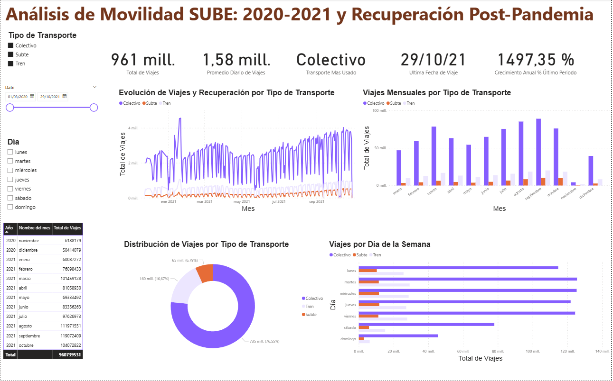

# 🚌 Análisis de Movilidad en CABA con Datos SUBE (2020-2021)

Este proyecto tiene como objetivo analizar los patrones de uso del transporte público en la Ciudad Autónoma de Buenos Aires durante los años 2020 y 2021, especialmente durante el contexto de la pandemia por COVID-19. Se trabajó con datos reales de la tarjeta SUBE, organizados, limpiados y visualizados utilizando herramientas como Excel, Python y Power BI.

---

## ⚙️ Herramientas utilizadas

- **Python** (pandas) para limpieza básica y estructura del dataset
- **Microsoft Excel** para el ordenamiento por fecha y verificación final
- **Power BI** para visualización interactiva de los datos
- **Git & GitHub** para control de versiones y publicación del proyecto

---

## 🔍 Objetivos del análisis

- Observar cómo impactó la pandemia en el uso del transporte público.
- Detectar qué medios (colectivo, tren, subte) se vieron más afectados.
- Comparar la evolución de viajes entre los años 2020 y 2021.
- Explorar la recuperación del uso del transporte hacia fines de 2021.

---

## 📊 Dashboard final



El dashboard fue creado en Power BI y permite explorar el volumen de viajes mensuales segmentado por tipo de transporte. Incluye comparativas entre ambos años y destaca visualmente los períodos más críticos de la pandemia.

---

## 🚀 Cómo usar este proyecto

1. Clonar el repositorio:
   ```bash
   git clone https://github.com/pabl3/transporte-caba-datos.git

## 📝 Conclusiones

La cantidad de viajes cayó abruptamente en marzo y abril de 2020.
El colectivo fue el transporte más utilizado durante todo el período.
Si bien hubo una recuperación progresiva, el volumen total de viajes en 2021 todavía no alcanzó los niveles prepandemia.

## 📂 Fuente de datos
Los datos utilizados fueron publicados por el Gobierno de la Nación Argentina en el portal oficial de datos abiertos:
https://datos.gob.ar/


## Autor:
Pablo Asselborn
Estudiante de Ciencia de Datos | Analista de Datos Jr.
📍 Argentina
LinkedIn: https://www.linkedin.com/in/pablo-asselborn-39b815247/

